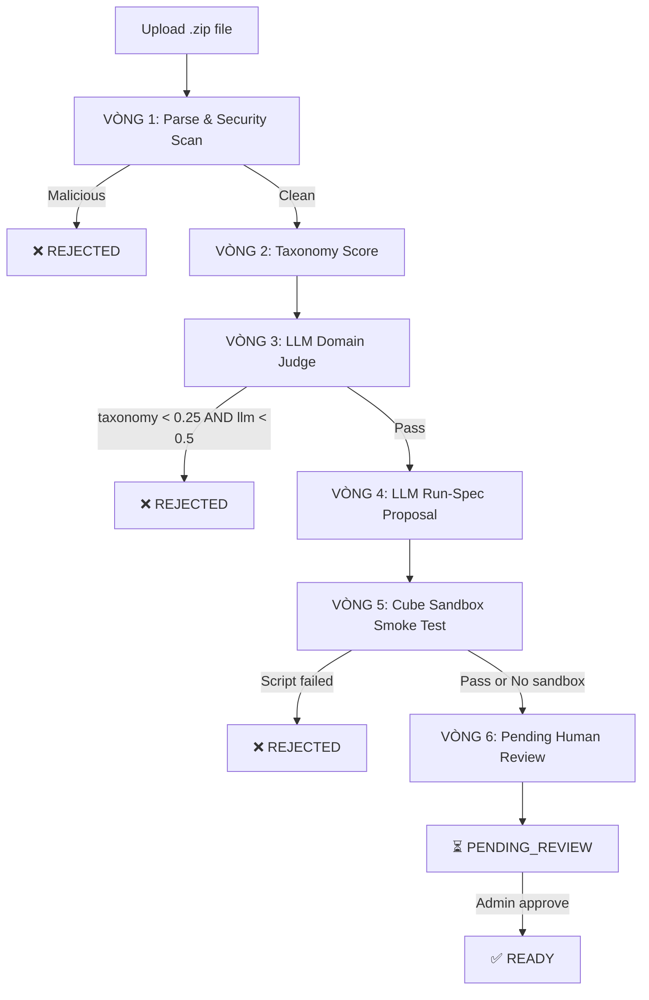
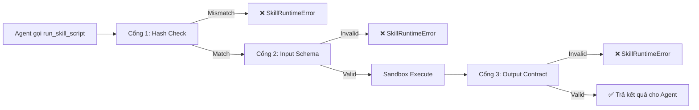

# Skill Validation Pipeline — Chi tiết luồng kiểm duyệt

## Tổng quan

Pipeline kiểm duyệt Skill gồm **6 vòng tự động** khi upload + **3 cổng bảo vệ runtime** khi Agent thực thi script. Toàn bộ logic nằm trong 2 file chính:
- Upload pipeline: [skills.py](file:///home/vqt/UET/Project/Telecom-Agent-Execution-engine/backend/app/services/skills.py)
- Runtime gates: [builtin_tools.py](file:///home/vqt/UET/Project/Telecom-Agent-Execution-engine/backend/app/agent/builtin_tools.py)

---

## Phần A: Upload Pipeline (6 Vòng)



### VÒNG 1: Zip Package Parsing + Static Security Scan

**Bước 1a — Giải nén & Kiểm tra cấu trúc zip** ([skills.py:92-155](file:///home/vqt/UET/Project/Telecom-Agent-Execution-engine/backend/app/services/skills.py#L92-L155))

| Kiểm tra | Giới hạn | Hành vi khi vi phạm |
|----------|----------|---------------------|
| Kích thước archive | ≤ 10 MB | REJECTED |
| Số lượng file | ≤ 200 | REJECTED |
| Kích thước từng file | ≤ 5 MB | REJECTED |
| Tổng dung lượng giải nén | ≤ 25 MB | REJECTED |
| Tỷ lệ nén (zip bomb) | ≤ 100x | REJECTED |
| Symbolic link | Cấm | REJECTED |
| File mã hóa | Cấm | REJECTED |
| Path traversal (`..`, absolute) | Cấm | REJECTED |
| Backslash trong path | Cấm | REJECTED |
| Duplicate path | Cấm | REJECTED |
| File `SKILL.md` | Phải có đúng 1 | REJECTED |
| Encoding `SKILL.md` | UTF-8 | REJECTED |

**Bước 1b — Parse YAML Frontmatter** ([skills.py:450-542](file:///home/vqt/UET/Project/Telecom-Agent-Execution-engine/backend/app/services/skills.py#L450-L542))

| Field | Yêu cầu |
|-------|---------|
| `name` | Regex `^(?!-)(?!.*--)[a-z0-9]+(?:-[a-z0-9]+)*$`, ≤ 64 ký tự |
| `description` | Chuỗi không rỗng, ≤ 1024 ký tự |
| `license` | Chuỗi (optional) |
| `compatibility` | Chuỗi 1-500 ký tự (optional) |
| `metadata` | Mapping string→string (optional) |
| `allowed-tools` | Chuỗi (optional) |
| Các field khác | Cấm — báo lỗi unknown fields |

**Bước 1c — Kiểm tra trùng tên** ([skills.py:168-177](file:///home/vqt/UET/Project/Telecom-Agent-Execution-engine/backend/app/services/skills.py#L168-L177))

Nếu skill cùng tên đã tồn tại trong DB → trả về HTTP `409 CONFLICT`.

**Bước 1d — Static AST Security Scan** ([security_analyzer.py](file:///home/vqt/UET/Project/Telecom-Agent-Execution-engine/backend/app/sandbox/security_analyzer.py))

Quét toàn bộ file `.py` trong gói bằng `ast.walk()`:

| Loại kiểm tra | Chi tiết |
|---------------|----------|
| **Import cấm** | 40+ module hệ thống: `os`, `subprocess`, `socket`, `sys`, `requests`, `httpx`, `paramiko`, `pathlib`, `io`, `pickle`, `shutil`, `importlib`, `ctypes`, `threading`, `asyncio`, `inspect`... |
| **Hàm cấm** | `eval`, `exec`, `compile`, `__import__`, `getattr`, `setattr`, `delattr`, `vars`, `globals`, `locals`, `memoryview`, `breakpoint`, `input` |
| **Dunder jailbreak** | Chặn `obj.__class__.__bases__`, `f.__init__.__globals__`, `__builtins__["eval"]` — mọi truy cập thuộc tính `__xxx__` (trừ `__name__`, `__doc__`, `__file__`) |
| **open() có điều kiện** | Chỉ cho phép: path là chuỗi literal, tương đối, không chứa `..` hoặc `\`, mode chỉ-đọc (`"r"`, `"rb"`, `"rt"`) |
| **Chuỗi nhạy cảm** | Phát hiện: `/etc/passwd`, `.env`, `id_rsa`, `private_key`, `/etc/shadow` |
| **PII/Secret scan** | Regex quét password, API key, private key trong toàn bộ text files |

### VÒNG 2: Telecom Taxonomy Score ([domain_validator.py:59-70](file:///home/vqt/UET/Project/Telecom-Agent-Execution-engine/backend/app/sandbox/domain_validator.py#L59-L70))

Đếm từ khóa chuyên ngành viễn thông trong `name + description + body`:

```
TELECOM_TAXONOMY = {alarm, alert, node, cluster, site, cell, service, interface,
                    kpi, latency, packet_loss, throughput, snmp, prometheus,
                    clickhouse, ran, core_network, gnodeb, enodeb, router,
                    switch, noc, soc, vdt}
```

**Công thức:** `score = min(matched_keywords / 4, 1.0)`

### VÒNG 3: LLM Domain Judge ([domain_validator.py:72-140](file:///home/vqt/UET/Project/Telecom-Agent-Execution-engine/backend/app/sandbox/domain_validator.py#L72-L140))

Gọi LLM Gateway để đánh giá skill có phục vụ viễn thông không, trả về:
- `domain_score`: 0.0 → 1.0
- `reason`: giải thích
- `suspicious_points`: điểm nghi vấn

**Ngưỡng loại:** Nếu `taxonomy_score < 0.25` **VÀ** `llm_score < 0.5` → REJECTED.

### VÒNG 4: LLM Run-Spec Proposal ([skills.py:605-659](file:///home/vqt/UET/Project/Telecom-Agent-Execution-engine/backend/app/services/skills.py#L605-L659))

Gọi LLM phân tích từng script Python để đề xuất:
- `input_schema`: JSON Schema cho tham số đầu vào
- `output_contract`: `{mode: "json", schema: {...}}` hoặc `{mode: "text"}`
- `smoke_test.arguments`: dữ liệu test mẫu
- `runtime.arguments_mode`: `"args_json"` hoặc `"none"`
- `limits.timeout_seconds`: 1-120 giây

Merge vào `script_manifest` cùng `script_hash` (SHA256 của nội dung file).

### VÒNG 5: Cube Sandbox Smoke Test ([skills.py:257-366](file:///home/vqt/UET/Project/Telecom-Agent-Execution-engine/backend/app/services/skills.py#L257-L366))

Nếu Cube Sandbox đã cấu hình (`CUBE_SANDBOX_API_URL` + `CUBE_SANDBOX_API_KEY`):
1. Upload file script vào sandbox container
2. Chạy thử với `smoke_test.arguments` từ Vòng 4
3. Kiểm tra `exit_code == 0`
4. Kiểm tra output khớp `output_contract` (nếu mode là json)
5. Nếu pass → `status = "passed"`, nếu fail → REJECTED

Nếu chưa cấu hình → `status = "pending_sandbox"`, không thể approve.

### VÒNG 6: Pending Human Review

Skill được lưu vào DB với `status = "testing"`, chờ admin approve qua API `/api/v1/skills/{id}/approve`.

> [!IMPORTANT]
> Chỉ có thể approve khi **tất cả** scripts trong `script_manifest` có `status = "passed"`. Nếu bất kỳ script nào còn `pending_sandbox` hoặc `failed`, API trả về `409 Conflict`.

---

## Phần B: Runtime Security Gates (3 Cổng)

Khi Agent gọi tool `run_skill_script`, hệ thống chạy 3 cổng kiểm tra **trước** khi thực thi script:



### Cổng 1: Script Hash Verification ([builtin_tools.py:854-861](file:///home/vqt/UET/Project/Telecom-Agent-Execution-engine/backend/app/agent/builtin_tools.py#L854-L861))

So sánh SHA256 của nội dung file hiện tại trong DB với hash đã lưu lúc duyệt.
- **Mục đích:** Chống sửa file lén lút sau khi đã được phê duyệt
- **Nếu mismatch:** Chặn đứng, không cho chạy

### Cổng 2: Input Schema Validation ([builtin_tools.py:864-878](file:///home/vqt/UET/Project/Telecom-Agent-Execution-engine/backend/app/agent/builtin_tools.py#L864-L878))

Kiểm tra arguments Agent truyền vào có khớp `input_schema` đã duyệt không.
- **Mục đích:** Chống LLM truyền tham số sai kiểu/thiếu trường bắt buộc
- **Nếu invalid:** Chặn trước khi gọi sandbox, tiết kiệm tài nguyên

### Cổng 3: Output Contract Validation ([builtin_tools.py:881-901](file:///home/vqt/UET/Project/Telecom-Agent-Execution-engine/backend/app/agent/builtin_tools.py#L881-L901))

Sau khi sandbox trả kết quả, kiểm tra stdout khớp `output_contract`:
- Nếu `mode = "json"`: parse JSON, validate theo schema
- Nếu `mode = "text"`: bỏ qua validation
- **Mục đích:** Đảm bảo script trả dữ liệu đúng cấu trúc cho Agent xử lý

---

## Phần C: Tổng kết kiểm thử đã thực hiện

### Upload Pipeline Tests (gọi API thật qua HTTP)

| Test | Kịch bản | Kết quả | Vòng chặn |
|------|----------|---------|-----------|
| Malicious AST | `import os`, đọc `/etc/passwd` | ❌ 400 REJECTED | Vòng 1d |
| Invalid name | Tên chứa `_` | ❌ 400 REJECTED | Vòng 1b |
| Valid skill | Script sạch, đúng chuẩn | ✅ 200 PENDING_REVIEW | Qua Vòng 1-6 |

### Runtime Gate Tests (chạy trong container backend, DB thật)

| Test | Cổng | Kịch bản | Kết quả |
|------|------|----------|---------|
| Hash mismatch | Cổng 1 | Sửa nội dung file sau duyệt | ❌ `Script hash mismatch` |
| Input schema | Cổng 2 | Truyền int thay vì string | ❌ `Arguments không khớp approved schema` |
| Invalid JSON | Cổng 3 | Script trả text thay vì JSON | ❌ `stdout is not valid JSON` |
| Wrong schema | Cổng 3 | `status: 999` thay vì string | ❌ `Output contract failed` |
| Happy path | Cả 3 | Hash đúng, input đúng, output đúng | ✅ `{"status": "UP"}` |

### Environment Read-Write Tests (kết nối thật tới anhvhn.duckdns.org)

| Test | Môi trường | Kịch bản | Kết quả |
|------|-----------|----------|---------|
| CH Read | ClickHouse:8123 | `SELECT 1` | ✅ `[{'val': 1}]` |
| CH Write blocked | ClickHouse:8123 | `CREATE TABLE` + `readonly=2` | ❌ `Code 164: READONLY` |
| PG Read | Postgres:8010 | `SELECT 1` | ✅ `[{'val': 1}]` |
| PG Write blocked | Postgres:8010 | `CREATE TABLE` + `READ ONLY` | ❌ `ReadOnlySqlTransaction` |
| PG Write approved | Postgres:8010 | `CREATE TABLE` + `read_only=False` | ✅ `SUCCESS` |
| SSH safe cmd | SSH:2222 | `uname -a` | ✅ `Linux namanhserver...` |
| SSH blocked cmd | SSH:2222 | `cat /etc/shadow` | ❌ `CẢNH BÁO AN NINH` |
